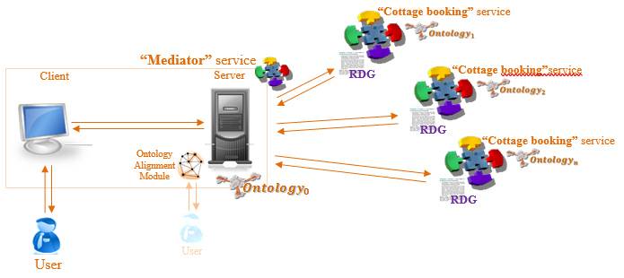

# CottageBooking_Service
SSWAP-based cottage booking service demonstration

## Running the service
Requires JVM version 1.8.0_161
1. Run the war-files on your local server, e.g. Apache Tomcat.
2. Use the CottageBooking_Mediator application to query available cottages.
3. You can try to use another cottage service by changing the *Service URL* to http://localhost:8080/CottageBooking_SSWAP/getService.
4. The cottage data is stored in an [RDF-file](CottageBooking_SSWAP/src/main/webapp/res/cottageDB.ttl).
  - To get the "fake" service work properly, ontology alignment is required. You can try the automatic filled values for the first alignment.
  - To create new alignment, click the *Delete Alignment* button and make a new query.
  - To fix the alignment perfectly, you need to match the vocabulary of ["domestic"](CottageBooking_SSWAP/src/main/webapp/res/mySSWAPServiceRDG) and ["foreign"](CottageBooking_Fake/src/main/webapp/res/mySSWAPServiceRDG) ontologies.

## Background

The purpose of the software is to demonstrate an implementation of [Semantic Web Services](https://en.wikipedia.org/wiki/Semantic_web_service). The idea is that the "mediator" service would be able to utilize remote independent services without any dependency on their actual implementation with the help of [SSWAP](https://sourceforge.net/p/sswap/wiki/protocol/). The problem might occur on semantic level, due to the difference of domain [ontologies](https://en.wikipedia.org/wiki/Web_Ontology_Language) used by these services. Therefore all other ontologies must be mapped to the ontology the "domestic" client supports. This is done by automatic ontology alignment with the help of user input, if the automatic alignment is not confident enough.

